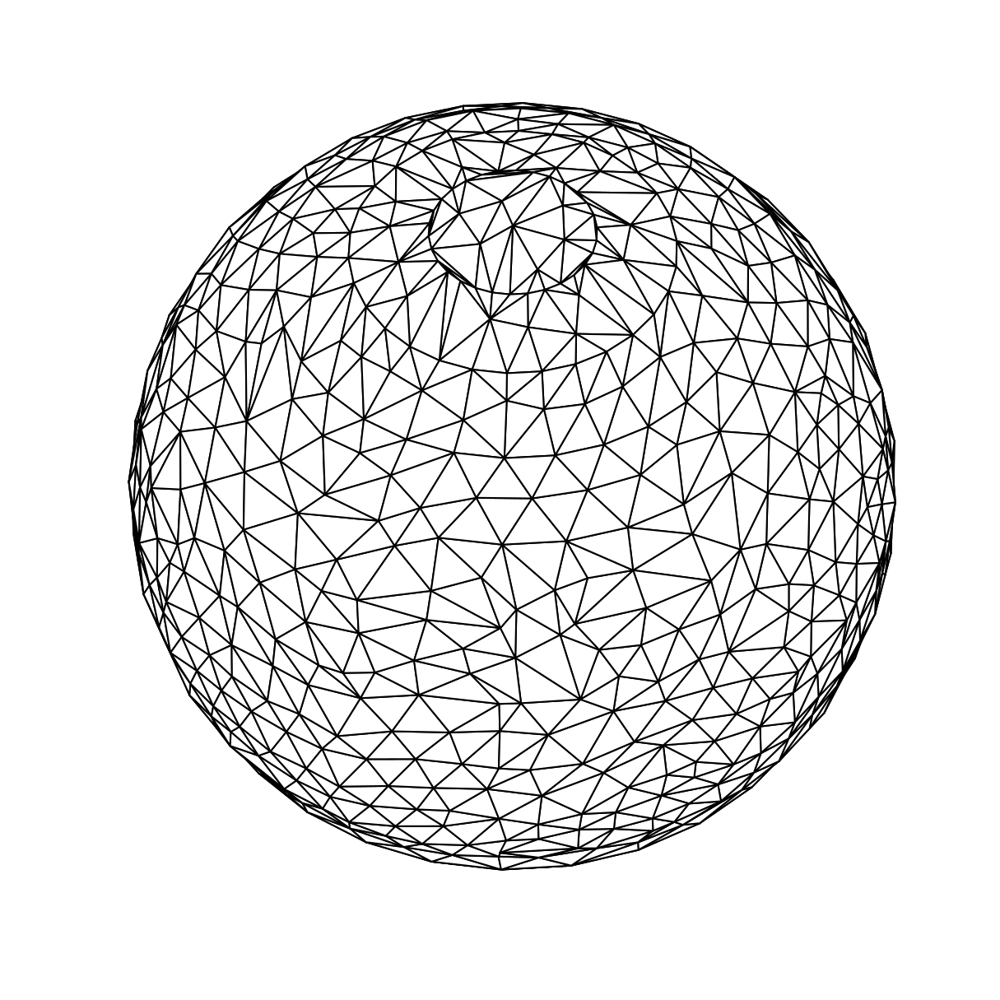
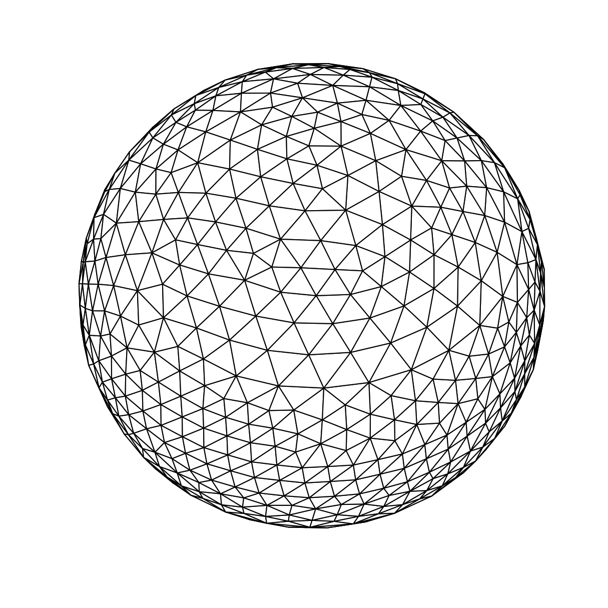
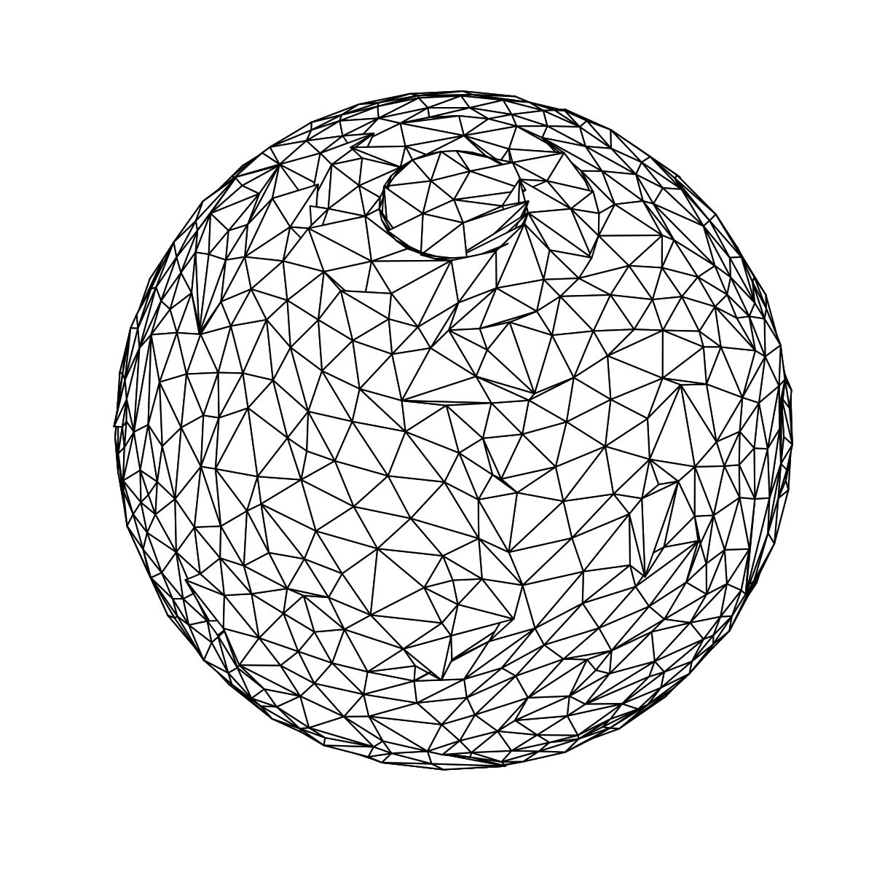

# Isotropic Remesher

A Python implementation of isometric remeshing algorithm based on Open3D library.

The basic idea is to iterate over these operations:

1. **split long edges**
2. **collapse short edges**
3. **equalize valences**
4. **tangential smoothing**
5. **back to surface**

Included some features such as:

* connectivity checking in collapse and equalize operations
* collinear checking in equalize operation
* [optional] set the initial vertices as fixed (```explicit = True```)
* [optional] control of foldover triangles by the angle of the normals before and after the collapse and flip edge operations (```foldover = [degrees]```)
* [optional] control of sliver triangles by compactness before and after the flip edge operation (```sliver = True```)

## Usage
```python
from half_edge import HalfEdgeModel
from isotropic_remesher import IsotropicRemesher

# set an initial triangle mesh
sphere = TriangleMesh().create_sphere(radius=1, resolution=15)

# create a HalfEdgeModel (https://github.com/sfcaracciolo/half_edge)
model = HalfEdgeModel(sphere.vertices, sphere.triangles)

# create the remesher
remesher = IsotropicRemesher(model)

# apply remeshing
remesher.isotropic_remeshing(
    .14, # L_target, 
    iter=20, 
    explicit=True, 
    foldover=10, # degrees
    sliver=True
)

```
### Examples

In all cases ```L = .14```, ```iter = 20``` and the following surface as input:


**Case 0**: ```explicit = False```, ```foldover = 0``` and ```sliver = False```


**Case 1**: ```explicit = False```, ```foldover = 0``` and ```sliver = True```. 



**Case 2**: ```explicit = True```, ```foldover = 0``` and ```sliver = False```. The fixed vertices promoted self-intertersections.


**Case 3**: ```explicit = True```, ```foldover = 10``` and ```sliver = False```. The foldover parameter help us to avoid the self-intersections.



**Case 4**: ```explicit = True```, ```foldover = 10``` and ```sliver = True```. The sliver parameter enhance the compactness of the triangles.




